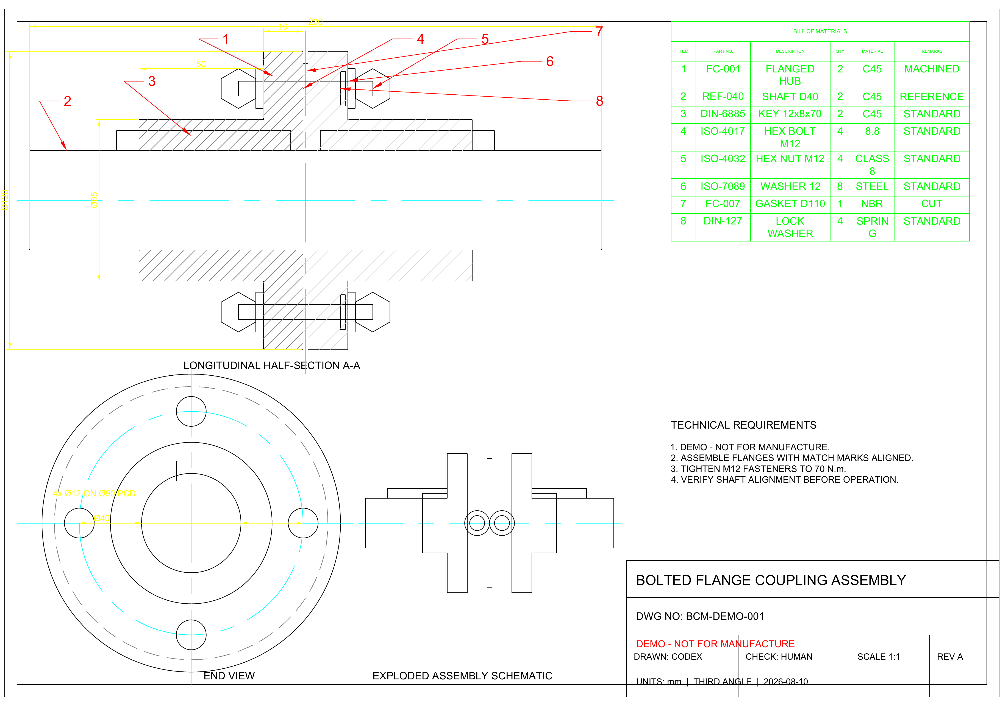

# best-cad-mcp

<!-- mcp-name: io.github.LokmenoWer/best-cad-mcp -->

[](https://pypi.org/project/best-cad-mcp/)
[](https://pypi.org/project/best-cad-mcp/)

[](https://github.com/LokmenoWer/best-cad-mcp/blob/master/LICENSE)

**让智能体通过 MCP 在本机可靠地操作真实 AutoCAD 图纸。**

读取 DWG、理解结构化几何、预演受控修改、验证结果并导出视觉证据；
模型的工作状态保存在图纸之外，不往 DWG 里塞隐藏标记。

[English](https://github.com/LokmenoWer/best-cad-mcp/blob/master/README.md) · [真实演示](#真实-autocad-演示) · [快速开始](#快速开始) · [安全工作流](#受控工作流) · [工具档位](#工具档位) · [安全模型](#安全模型)


*由经过验证和 dry-run 的 CADPlan 在真实 AutoCAD 模型空间中绘制并导出：主视图、
俯视图、右侧 A–A 剖视图、中心线、尺寸、特征标注、剖面线和标题栏。可下载
[源 DWG](https://raw.githubusercontent.com/LokmenoWer/best-cad-mcp/master/docs/artifacts/readme-real-cad/bearing-housing-three-view.dwg)，
或检查[实际执行的 CADPlan](https://github.com/LokmenoWer/best-cad-mcp/blob/master/docs/artifacts/readme-real-cad/cadplan.json)。*

> [!IMPORTANT]
> best-cad-mcp 仍处于 Beta。它面向“操作员能审阅计划和证据”的本地受控流程，
> 不应被当作无人值守、可以直接修改重要生产图纸的机器人。

## 为什么选择 best-cad-mcp

很多 CAD 自动化只能画线、圆和矩形。真正可用的智能体还必须知道它改的是
**哪个对象**、为什么选中它，以及结果是否正确。

| 句柄优先控制 | 图纸理解 | 先证据、后信任 |
| --- | --- | --- |
| 扫描 AutoCAD 真实句柄，查询精确实体，并按句柄修改，而不是从标签或像素猜目标。 | 在本地工作区生成 CAD-IR、语义对象与图、尺寸绑定、约束和验证报告。 | 先验证和 dry-run CADPlan，再明确执行、重新扫描，并对照结构化与视觉结果。 |

服务在与 AutoCAD 相同的 Windows 账户下运行，通过 MCP stdio 通信。它原生
使用官方 MCP Python SDK 2.x，可协商 2026-07-28 协议，并保留旧版客户端
协商能力。AutoCAD 始终是真实数据源；SQLite 只保存模型私有上下文、扫描结果
和审阅产物。所有 AutoCAD 工具调用会刻意在单一事件循环线程串行执行，以保持
COM apartment 安全。

## 真实 AutoCAD 演示

> **提示词：** 在模型空间按 1:1 真实尺寸创建一张 A3 横向螺栓法兰联轴器
> 装配图，包含纵向半剖主视图、对齐端视图、爆炸示意、真实尺寸、差异化剖面线、
> 8 项 BOM、匹配的零件引线、技术要求和受控标题栏。



这是一次真实 AutoCAD 会话的实际结果，不是手工绘制的 SVG。MCP 客户端先加载
仓库提供的 `precise_draw_from_spec` 提示词，再执行 18 个有界生成阶段（162 步）。
自动视觉修复闭环使用 2 个布局修复计划（4 步）；随后为发布展示另行记录并授权
了 3 个仅涉及呈现的 QA 计划（10 步）。每个计划都先完成校验和 dry-run，再以事务
方式执行。最终复扫索引了 91 个实体；结构化验证识别 129 个语义对象、处理
7 个真实尺寸标注，并检查 134 条约束（127 条满足、7 条未知、0 条违反）。修复后的几何
验证未报告问题；最终发布图也已独立确认为单页横向 A3 PDF。

为了能够稳定复现，仓库中的 MCP 客户端会构建本次记录所用的确定性 CADPlan。
这个演示展示的是优化提示词所定义的受控工作流在真实 AutoCAD 中的执行过程，
而不是一次无脚本的“一句话直出”式 LLM 生成。

[DXF](examples/live-flange-coupling-demo/flange-coupling-assembly-final.DXF)
· [A3 PDF](examples/live-flange-coupling-demo/flange-coupling-assembly-readme-demo.pdf)
· [完整提示词](examples/live-flange-coupling-demo/prompt.md)
· [CADPlan 包](examples/live-flange-coupling-demo/cadplans.json)
· [验证报告](examples/live-flange-coupling-demo/verification-report.json)
· [MCP 客户端](examples/live-flange-coupling-demo/generate_demo.py)

该图遵循仓库的通用机械装配实践，并明确标注 `DEMO - NOT FOR MANUFACTURE`；
它不声明正式符合 ISO、GB、ASME 或其他制图标准。

## 快速开始

### 环境要求

- Windows
- 已安装并授权的 AutoCAD，推荐 2020 或更新版本
- AutoCAD 与 MCP 客户端使用同一个 Windows 用户运行
- Python 3.11 或更新版本
- 支持本地 MCP 的客户端

### 安装发布包

```powershell
python -m pip install --upgrade best-cad-mcp
cad-mcp-doctor --check-autocad
```

如需覆盖层渲染和视觉审阅辅助：

```powershell
python -m pip install --upgrade "best-cad-mcp[visual]"
cad-mcp-doctor --check-autocad --require-visual-export
```

保持 AutoCAD 打开，然后配置 MCP 客户端启动 `cad-mcp`。

### Codex

Codex 支持全局 `~/.codex/config.toml`，也支持已信任项目下的
`.codex/config.toml`。下面是安装发布包后的最小配置，默认使用经过筛选的
`core` 工具档位：

```toml
[mcp_servers.best-cad-mcp]
command = "cad-mcp"
cwd = 'C:\CAD\your-project'
enabled = true
startup_timeout_sec = 30
tool_timeout_sec = 120
default_tools_approval_mode = "writes"

[mcp_servers.best-cad-mcp.env]
CAD_MCP_TOOL_PROFILE = "core"
CAD_MCP_WORKSPACE_ROOT = 'C:\CAD\your-project'
```

编辑后重启 Codex，再用 `/mcp` 检查连接状态。配置作用域和最新字段以
[Codex 官方 MCP 配置文档](https://developers.openai.com/codex/mcp)为准。

### Claude Code 和其他 JSON 配置客户端

```json
{
  "mcpServers": {
    "best-cad-mcp": {
      "command": "cad-mcp",
      "env": {
        "CAD_MCP_TOOL_PROFILE": "core",
        "CAD_MCP_WORKSPACE_ROOT": "C:\\CAD\\your-project"
      }
    }
  }
}
```

把它保存为 CAD 项目根目录下的 `.mcp.json`，并从该项目启动客户端。
`CAD_MCP_WORKSPACE_ROOT` 应指向正在处理的 CAD 项目，而不是本仓库。使用安装包
时，让进程 `cwd` 与工作区根目录都指向该项目，可以把运行文件放在一起。

<details>
<summary>从源码安装</summary>

```powershell
git clone https://github.com/LokmenoWer/best-cad-mcp.git
cd best-cad-mcp
python -m venv .venv
.\.venv\Scripts\Activate.ps1
python -m pip install --upgrade pip
python -m pip install -e ".[visual]"
.\.venv\Scripts\python.exe -m src.doctor --check-autocad
```

源码模式下，从仓库目录运行 `python -m src.server`，或把 MCP 服务的
`cwd` 指向仓库；但 `CAD_MCP_WORKSPACE_ROOT` 仍应指向要索引的独立 CAD
项目。

</details>

## 受控工作流


1. **预检**：运行 `check_runtime_environment(check_autocad=true)` 或
   `cad-mcp-doctor --check-autocad`；结果为 `ok=false` 时停止。
2. **扫描**：理解已有 DWG 前，先运行 `scan_all_entities`。需要 primitive
   grounding 或跨实体轮廓时使用 `topology_detail="full"`。
3. **理解**：构建 CAD-IR、汇总图纸、查询语义；重要目标再用
   `explain_entity` 确认。
4. **规划**：把多步修改写成 CADPlan，依次调用 `validate_cad_plan` 和
   `dry_run_cad_plan`。
5. **明确执行**：只有 dry-run 结果可接受且已获修改授权时，才调用
   `execute_cad_plan(..., allow_modify=true, transactional=true)`。
6. **复核**：重新扫描、运行几何验证、导出干净视图与覆盖层；只有操作员确实
   要持久化时才保存 DWG。

精确修改应优先使用 AutoCAD 返回的句柄，而不是从截图猜名称。视觉发现只是
证据：修改前还要确认候选实体和几何。

## 能做什么

| 领域 | 代表能力 |
| --- | --- |
| 二维制图 | 直线、多段线、曲线、圆、面域、填充、文字、尺寸、引线、表格、图层、块和属性 |
| 编辑 | 移动、复制、旋转、缩放、镜像、偏移、修剪、延伸、圆角、倒角、阵列、属性、选择集和句柄定点修改 |
| 图纸理解 | SQLite 扫描、CAD-IR v2、摘要、语义对象/图、约束、尺寸绑定、验证和修复建议 |
| 受控自动化 | CADPlan 变量、依赖、句柄捕获、前后置条件、dry-run、事务执行、撤销和回滚尝试 |
| 视觉定位 | 干净导出、自适应数字覆盖层、像素/世界坐标映射、路径和多边形定位、分块图像及 VLM 发现对齐 |
| 图片临摹 | ImageDrawingSpec、坐标标定、保真度检查、分阶段执行和源图/结果图视觉对比 |
| 机械图 | 多视图、剖视、填充、中心线、尺寸、BOM、气泡序号、布局，以及装配图提示词/技能资源 |
| 三维与输出 | 三维实体及操作、布局、打印、PDF/DXF/DWF/图片导出，以及工具结果内直接返回图片 |

### 工具档位

随仓库提供的客户端配置和示例推荐 `core`：它覆盖常规受控工作流，也更容易让
智能体稳定选对工具。为兼容旧版本，没有设置环境变量时 Python 服务会回退到
`full`。

| 档位 | 工具数 | 适用场景 |
| --- | ---: | --- |
| `lean` | 114 | 常见制图与检查任务的最小可靠工具面 |
| `core` | 215 | 推荐默认值，覆盖完整受控 CAD 工作流 |
| `full` | 322 | 全部已注册工具，包括专用和兼容性操作 |

通过 `CAD_MCP_TOOL_PROFILE=lean|core|full` 选择档位；还可以用
`CAD_MCP_TOOLS_INCLUDE` 和 `CAD_MCP_TOOLS_EXCLUDE` 做细粒度控制。

## 从视觉理解到可定位的 CAD 证据

首页图不是说明性模型或合成示意图。它由 90 步 CADPlan 在新建 AutoCAD 图纸中
绘制，扫描得到 81 个真实实体，几何验证为 0 个问题，再由 AutoCAD 导出 WMF 并
栅格化成上方 PNG。源 DWG、计划、dry-run、验证结果、像素/世界坐标映射和 VLM
审阅均作为可复核证据保留。

VLM 审阅不应只返回一句自然语言描述。下面两张图来自同一个真实 snapshot：左侧
是模型实际检查的 AutoCAD 栅格 tile，右侧是映射工具产生的真实句柄覆盖图，并非
为 README 重画的示意图。

| 真实 AutoCAD 栅格 tile | 同一 snapshot 的句柄覆盖图 |
| --- | --- |
|  |  |

覆盖图按 WMF 选择集导出画框配准，而不是套用当前视口。实现保留 AutoCAD 实测的
微小等比例画框边距，并排除旧的通用视口留白。本次真实截图中，映射后的主视图
原点为 `(734.870, 331.032)` px，PNG 上实际观察到的青色中心线交点为
`(735, 331)` px，最大误差仅 `0.13 px`。

真实的 `vlm_review_drawing/v3` 返回先通过 schema 校验，再在不预填句柄的情况下
提交定位。四个区域均直接从栅格图观察得到，并与该图的尺寸和 SHA-256 绑定；如果
AutoCAD 重新导出了不同图片，采集脚本会拒绝复用这些框。中央孔落到句柄 `8A`，
圆头安装槽语义轮廓落到 `115`，标题栏语义组落到
`236`。剖面线对应两个得分接近的真实 hatch，因此正确保留为 `ambiguous`。

```json
{
  "central_bore":  {"status": "grounded",  "handles": ["8A"]},
  "mounting_slot": {"status": "grounded",  "handles": ["115"]},
  "section_hatch": {"status": "ambiguous", "handles": []},
  "title_block":   {"status": "grounded",  "handles": ["236"]}
}
```

可继续检查[与原图哈希绑定的视觉观测](https://github.com/LokmenoWer/best-cad-mcp/blob/master/docs/artifacts/readme-real-cad/vlm-review-observed.json)、
[提交的 VLM 返回](https://github.com/LokmenoWer/best-cad-mcp/blob/master/docs/artifacts/readme-real-cad/vlm-review-raw.json)、
[定位后的结果](https://github.com/LokmenoWer/best-cad-mcp/blob/master/docs/artifacts/readme-real-cad/vlm-review-grounded.json)、
[像素/世界坐标对齐检查](https://github.com/LokmenoWer/best-cad-mcp/blob/master/docs/artifacts/readme-real-cad/view-alignment-check.json)、
[CADPlan dry-run](https://github.com/LokmenoWer/best-cad-mcp/blob/master/docs/artifacts/readme-real-cad/cadplan-dry-run.json)
和[零问题几何验证](https://github.com/LokmenoWer/best-cad-mcp/blob/master/docs/artifacts/readme-real-cad/geometry-validation.json)。

### 从单张图片临摹机械图

完整路径把“不修改图纸的理解与验证”和唯一一次需要明确授权的 DWG 修改阶段
分开，执行后再通过重新扫描和视觉差异比较闭环。本 README 不把生成的流程图当成
临摹证据；真实运行应保留源栅格图、`ImageDrawingSpec`、经过验证和 dry-run 的
CADPlan、结果 DWG 与最终 AutoCAD 导出。

典型循环如下：

1. 调用 `prepare_image_trace(image_path, domain="mechanical")`；
2. 用 `prepare_visual_semantic_context` 和 `get_trace_source_image` 检查全局图与
   tile；
3. 生成 `ImageDrawingSpec/v1`，测量坐标时原样回传该图像的
   `source_ref_template`；
4. 调用 `validate_image_drawing_spec`，再调用 `submit_image_drawing_spec`；
5. 调用 `compile_image_spec_to_cad_plan`；
6. 调用 `validate_image_fidelity_contract(spec, cad_plan)`；
7. 调用 `validate_cad_plan`，再调用 `dry_run_cad_plan`；
8. 获得授权后才调用
   `execute_cad_plan(..., allow_modify=true, transactional=true)`；
9. 重新扫描、验证，并把最终 AutoCAD 导出与源图对比。

不能因为 JSON 合法就直接执行临摹。先检查视图数量、对称性、尺寸、中心线、
孔位，以及源图与渲染图的保真度。

## v1.6 视觉定位

v1.6 引入图纸级边界拓扑：能从多个实体、直线-直线与受支持的直线-曲线交点和
闭合环中组装轮廓。需要 primitive 关系时使用
`scan_all_entities(topology_detail="full")`。定位证据现在包含真实路径/多边形
几何、多句柄候选、自适应覆盖层，以及支持 tile 的像素/世界坐标契约。

这会提高机械轮廓的选择质量，但视觉并不会因此变得绝对可靠。重要修改仍应遵循：

```text
视觉发现 -> 定位候选 -> explain_entity -> 按句柄修改
```

默认 VLM 审阅提示词为 `vlm_review_drawing/v3`。快照 schema 版本会直接返回在
工具结果中；覆盖层 schema 版本存放在工具结果所引用的 sidecar 文件内，严格
消费者可以据此识别契约变化。

## 安全模型

- 修改已有图纸前先读取和扫描。
- 原始命令、删除、purge、audit、保存、关闭和 `execute_cad_plan` 应保留
  客户端明确审批。
- 修改前验证并 dry-run 计划。
- 精确目标使用返回句柄和结构化几何。
- 修改后重新扫描，不使用过期 SQLite 记录。
- 模型私有笔记和空间标注保存在 `.cad_mcp/`，不写入可见 DWG 几何、XData
  或隐藏图层。
- 保存和关闭是两个独立的操作员决定。
- 顶视/平面模型空间是最可靠的定位场景；视图 twist、自定义 UCS、三维几何和
  复杂布局视口会降低置信度。

事务和回滚能降低风险，但无法保证从每一种 AutoCAD 或 COM 故障中恢复。
重要图纸请先使用副本。

## 工作区与数据

`CAD_MCP_WORKSPACE_ROOT` 控制
`<workspace>/.cad_mcp/workspace.db`。默认日志、视觉导出和图片临摹产物则相对
MCP 进程 `cwd` 写入 `cad_mcp.log`、`cad_visual_exports/` 和
`cad_image_traces/`。

外部 CAD 项目不会自动获得忽略规则。项目使用 Git 时请加入：

```gitignore
.cad_mcp/
cad_mcp.log
cad_visual_exports/
cad_image_traces/
```

数据库用于连接多轮上下文和工具结果，但 AutoCAD 才是真实来源。如果图纸在
服务之外发生变化，使用存储实体前应重新扫描。看到旧版根目录
`autocad_data.db` 警告时，应先核对迁移，再单独归档旧文件。

## 常见问题

| 现象 | 检查 |
| --- | --- |
| 升级后服务导入失败 | 使用客户端实际调用的同一个 Python 环境运行 `cad-mcp-doctor --json`。best-cad-mcp 1.7+ 要求 MCP Python SDK `>=2,<3`；若 `mcp_sdk_version` 被阻断，请升级包/环境并重启客户端。 |
| AutoCAD 已打开但不可用 | 运行 `cad-mcp-doctor --check-autocad`；确认两个进程使用相同 Windows 账户和权限级别。 |
| 服务暴露的工具太多 | 设置 `CAD_MCP_TOOL_PROFILE=core` 或 `lean`，再重启客户端。 |
| 视觉导出不可用 | `[visual]` 提供 Pillow 栅格覆盖层。在 Windows 上，AutoCAD WMF 会使用原生 GDI+ 回退；ImageMagick/Wand、Inkscape 或 LibreOffice 可作为替代路径。检查 `get_vision_capabilities()` 的 `wmf_to_png_available`；也可先导出 PDF 再外部栅格化。 |
| 查询返回旧实体 | 激活目标图纸并重新运行 `scan_all_entities`。 |
| MCP 从错误目录启动 | 只有源码开发时才把 `cwd` 指向仓库；`CAD_MCP_WORKSPACE_ROOT` 始终指向 CAD 项目。 |
| 计划被拒绝 | 运行 `validate_cad_plan`，检查具体失败步骤，修正后再次 dry-run。 |

输出机器可读诊断：

```powershell
cad-mcp-doctor --json
```

## 开发

```powershell
git clone https://github.com/LokmenoWer/best-cad-mcp.git
cd best-cad-mcp
python -m venv .venv
.\.venv\Scripts\Activate.ps1
python -m pip install -e ".[dev,visual]"
python -m pytest -q -m "not autocad_com"
```

Release 发布流程会校验版本、运行非 COM 测试（`autocad_com` 标记保留给本机
实时 CAD 检查）、验证原生 modern 与 legacy MCP stdio、构建并干净安装 wheel，
再用 Twine 检查并发布到 PyPI 和 MCP Registry。由于 hosted runner 没有
AutoCAD，实时 AutoCAD 预检与 CADPlan 验证必须在本机完成。

欢迎贡献。行为变化请加入回归测试，并保持“扫描 → 规划 → 验证 → 复核”的
安全模型。

## 致谢

模型私有标注和 pointer-style CAD 上下文设计在概念上参考了公开的
[Pointer-CAD](https://github.com/Snitro/Pointer-CAD) 项目和论文。本仓库没有
复制 Pointer-CAD 源码。

## 许可证

MIT。见 [LICENSE](https://github.com/LokmenoWer/best-cad-mcp/blob/master/LICENSE)。
